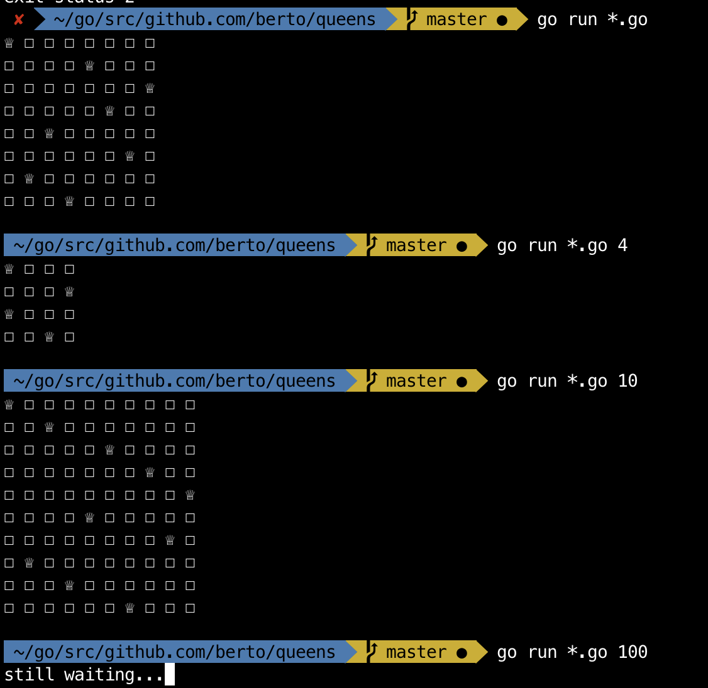

# N Queens

> Quick solution to n queens... and by quick, I mean I spent less than two hours

## Algorithm

Backtracking with recursion example. Probably a complexity of O(n^2), so not good. Don't try it with more than 20.

## Usage

`go run *.go {n}`
